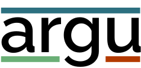

  

Argu is an open source e-democracy and community management platform.
It's a web application that is used to help organisations to get people engaged in decision making processes.

Use it to:

- **Inform and engage** your community using a variety of [Participation Tools](e-participation_tools.md)
- **Gain insights** in what people think about something using [Votes](voting.md) and [surveys](surveys.md)
- **Structure discussions** with [Arguments](arguments.md)
- **Discuss anything** using [Forums](forums.md) and Topics
- **Gather ideas** using [Challenges](challenges_and_ideas.md)

## Mission and history

The internet and democracy are two of the greatest inventions ever made, but for some reason it's hard to combine the two and get something better.
Many social media conversations tend to divide us further and preach to the choir.
No wonder that our decision making processes still rely almost completely on face-to-face contact.
This severely limits how many people can become engaged and share their thoughts on what they want different.

We wanted to design a digital tool that helps discussions to be **nuanced and solution oriented**, so they become valuable in the decision making process.
Argu was founded in 2014 by three friends in Utrecht, the Netherlands.
In the years since then, Argu has ben used by many (semi-)governments and other types of communities to make better decisions, together.

## Getting started

If you want to set up your own Argu website, you can use one of the [paid plans on Argu.co](https://argu.co/info/prijzen) or [host it yourself for free](https://gitlab.com/ontola/argu/).
